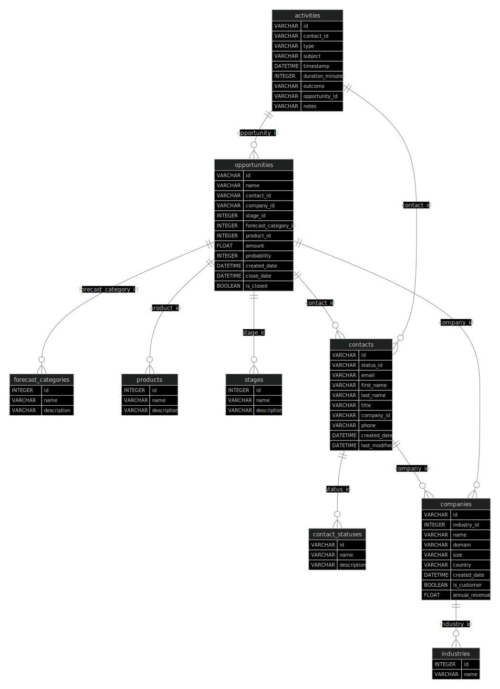
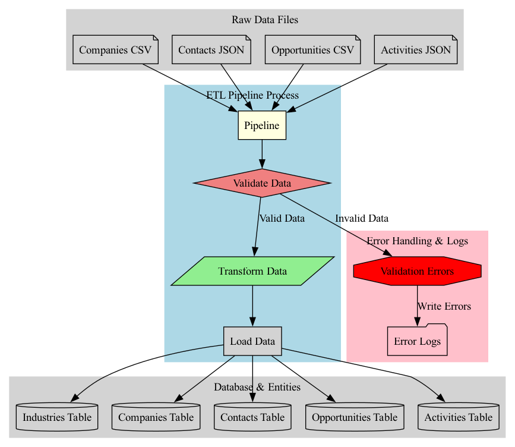

# ETL Pipeline Documentation

## Overview
This document outlines the cleaning rules and assumptions applied during the ETL (Extract, Transform, Load) process of the project. The ETL pipeline is designed to read data from JSON and CSV files, clean and validate the data, and then load it into a database.

## Data Sources
- **CSV Files**: 
  - `companies.csv`: Contains company data including industry, company ID, and other relevant fields.
  - `opportunities.csv`: Contains opportunity data including product, stage, and forecast category.
  
- **JSON Files**: 
  - `contacts.json`: Contains contact data including status and contact ID.
  - `activities.json`: Contains activity data including activity ID and other relevant fields.

## Cleaning Rules and Assumptions

### 1. General Cleaning Rules
- **Whitespace Removal**: Leading and trailing whitespaces are removed from all string fields to ensure uniformity.
- **Case Normalization**: Enumerations such as `Industry`, `Product`, `ContactStatus`, `Stage` and `ForecastCategory` names are converted to uppercase to avoid case sensitivity issues during lookups / to avoid potential duplicates.
- **Null Value Handling**: Fields with null or missing values are either filled with default values or marked for further review in data validation phase, depending on the field.
- **Foreign Keys**: All the FKs are non-nullable and also Indexed. The non-nullable part can be changed if required given the ETL data observations.

### 2. Specific Validation / Cleaning Rules

The following outlines the **data validation**, **indexing**, **uniqueness**, and **cleaning rules** for each column in the database tables. Each validation rule is implemented in a corresponding `validate_*` method.

#### Table: `industries`
| Column | Data Type | Indexed | Unique | Validation Rules | Validation Method |
|---------|----------|---------|--------|-----------------|-------------------|
| `id` | `Integer` | ✅ (Primary Key) | ✅ | Auto-incrementing primary key | N/A |
| `name` | `String` | ✅ | ✅ | Cannot be null, indexed | N/A |

#### Table: `companies`
| Column | Data Type | Indexed | Unique | Validation Rules | Validation Method |
|---------|----------|---------|--------|-----------------|-------------------|
| `id` | `String` | ✅ (Primary Key) | ✅ | Primary key | N/A |
| `industry_id` | `Integer` | ✅ | ❌ | Foreign key, must exist in `industries.id` | N/A |
| `name` | `String` | ❌ | ❌ | Stripped and converted to uppercase | `validate_name` |
| `domain` | `String` | ✅ | ✅ | Must be a valid domain format | `validate_domain` |
| `size` | `String` | ❌ | ❌ | Must be in valid format: single value, range (e.g., "1000-5000"), or with `+` | `validate_size` |
| `country` | `String` | ❌ | ❌ | Converted to ISO2 format, must be valid | `validate_country` |
| `created_date` | `DateTime` | ❌ | ❌ | Must be in ISO 8601 format, cannot be in the future | `validate_created_date` |
| `is_customer` | `Boolean` | ❌ | ❌ | Cannot be null | N/A |
| `annual_revenue` | `Float` | ❌ | ❌ | Cannot be null, must be a positive number | N/A |

#### Table: `contacts`
| Column | Data Type | Indexed | Unique | Validation Rules | Validation Method |
|---------|----------|---------|--------|-----------------|-------------------|
| `id` | `String` | ✅ (Primary Key) | ✅ | Primary key | N/A |
| `status_id` | `Integer` | ✅ | ❌ | Foreign key, must exist in `contact_statuses.id` | N/A |
| `company_id` | `String` | ✅ | ❌ | Foreign key, must exist in `companies.id` | N/A |
| `email` | `String` | ✅ | ✅ | Must be a valid email format | `validate_email` |
| `first_name` | `String` | ❌ | ❌ | Stripped and title-cased | `validate_first_name` |
| `last_name` | `String` | ❌ | ❌ | Stripped and title-cased | `validate_last_name` |
| `title` | `String` | ❌ | ❌ | Stripped | `validate_title` |
| `phone` | `String` | ❌ | ❌ | Must be a valid international format (if provided) | `validate_phone` |
| `created_date` | `DateTime` | ❌ | ❌ | Must be in ISO 8601 format, cannot be in the future | `validate_created_date` |
| `last_modified` | `DateTime` | ❌ | ❌ | Cannot be in the future, cannot be before `created_date` | `validate_last_modified` |

#### Table: `opportunities`
| Column | Data Type | Indexed | Unique | Validation Rules | Validation Method |
|---------|----------|---------|--------|-----------------|-------------------|
| `id` | `String` | ✅ (Primary Key) | ✅ | Primary key | N/A |
| `name` | `String` | ❌ | ❌ | Stripped and title-cased | `validate_name` |
| `contact_id` | `String` | ✅ | ❌ | Foreign key, must exist in `contacts.id` | N/A |
| `company_id` | `String` | ✅ | ❌ | Foreign key, must exist in `companies.id` | N/A |
| `stage_id` | `Integer` | ✅ | ❌ | Foreign key, must exist in `stages.id` | N/A |
| `forecast_category_id` | `Integer` | ✅ | ❌ | Foreign key, must exist in `forecast_categories.id` | N/A |
| `product_id` | `Integer` | ✅ | ❌ | Foreign key, must exist in `products.id` | N/A |
| `amount` | `Float` | ❌ | ❌ | Must be non-negative | `validate_amount` |
| `probability` | `Integer` | ❌ | ❌ | Must be between 0 and 100 | `validate_probability` |
| `created_date` | `DateTime` | ❌ | ❌ | Must be in ISO 8601 format, cannot be in the future | `validate_created_date` |
| `close_date` | `DateTime` | ❌ | ❌ | Must be in ISO 8601 format | `validate_close_date` |

#### Table: `activities`
| Column | Data Type | Indexed | Unique | Validation Rules | Validation Method |
|---------|----------|---------|--------|-----------------|-------------------|
| `id` | `String` | ✅ (Primary Key) | ✅ | Primary key | N/A |
| `contact_id` | `String` | ✅ | ❌ | Foreign key, must exist in `contacts.id` | N/A |
| `type` | `String` | ❌ | ❌ | Stripped and uppercase | `validate_type` |
| `subject` | `String` | ❌ | ❌ | Stripped and lowercased | `validate_subject` |
| `timestamp` | `DateTime` | ✅ | ❌ | Must be in ISO 8601 format | `validate_timestamp` |
| `duration_minutes` | `Integer` | ❌ | ❌ | Must be a non-negative integer | `validate_duration_minutes` |
| `outcome` | `String` | ❌ | ❌ | Cannot be null | N/A |
| `opportunity_id` | `String` | ✅ | ❌ | Foreign key, nullable | N/A |
| `notes` | `String` | ❌ | ❌ | Optional | N/A |

### 3. Assumptions
- **Data Completeness**: It is assumed that the input data files are complete and contain all necessary fields for processing. Missing fields may lead to data exclusion.
- **Data Integrity**: It is assumed that the data provided in the input files is accurate and reliable. Any discrepancies found during validation will be logged for further investigation.
- **Predefined Enumeration**: The cleaning process relies on predefined Enumerations. It is assumed that these enumeration are maintained and ETL process will only ingest them if they do not already exist.
- **Unique Identifiers**: It is assumed that all entities (companies, contacts, opportunities, activities) have unique identifiers that are correctly formatted and maintained.

### 4. Entity-Relationship (ER) Diagram

The following is ER Diagram for database schema to visualize the relationships:

### 5. Data-flow Diagram

The following is a minimalistic data flow diagram to visualize workflow:

## Conclusion
This document serves as a guideline for the cleaning rules and assumptions applied in the ETL pipeline. Adhering to these rules ensures that the data loaded into the database is clean, consistent, and reliable for further analysis and reporting. The will subject to amendment as the pipeline gets mature based on observation on the data records flagged validation phase.
